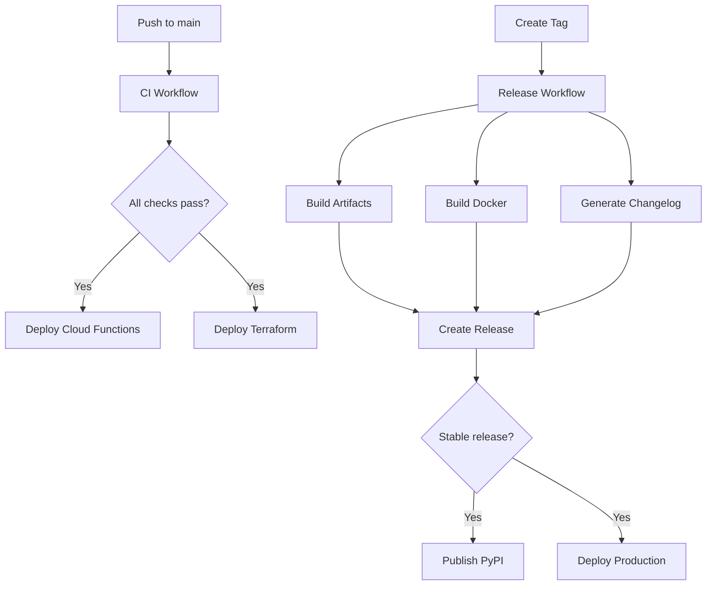

# GitHub Actions Workflows Documentation

This document describes all GitHub Actions workflows configured for the iam-looker project.

## Table of Contents

- [Overview](#overview)
- [Required Secrets](#required-secrets)
- [Workflows](#workflows)
  - [CI Workflow](#ci-workflow)
  - [PR Comment Workflows](#pr-comment-workflows)
  - [Deploy Cloud Functions](#deploy-cloud-functions)
  - [Deploy Terraform](#deploy-terraform)
  - [Release](#release)
  - [CodeQL Security Analysis](#codeql-security-analysis)
- [Environments](#environments)
- [Usage Examples](#usage-examples)

## Overview

The iam-looker project uses GitHub Actions for:
- Continuous Integration (CI)
- PR status comments and check summaries
- Cloud Functions deployment to GCP
- Terraform infrastructure deployment
- Automated releases with changelog generation
- Security scanning and vulnerability detection

## Required Secrets

### GitHub Repository Secrets

Configure these in **Settings → Secrets and variables → Actions**:

#### Workload Identity Federation (WIF)
```
WIF_PROVIDER              # Workload Identity Provider resource name
WIF_SERVICE_ACCOUNT       # Service account email for GitHub Actions
```

Example values:
```
WIF_PROVIDER=projects/PROJECT_NUMBER/locations/global/workloadIdentityPools/github-pool/providers/github-provider
WIF_SERVICE_ACCOUNT=github-actions@PROJECT_ID.iam.gserviceaccount.com
```

#### GCP Project Configuration
```
# Development
GCP_PROJECT_ID_DEV        # Development project ID
GCP_PROJECT_NUMBER        # Project number

# Staging (optional)
GCP_PROJECT_ID_STAGING    # Staging project ID

# Production
GCP_PROJECT_ID_PROD       # Production project ID

# Common
GCP_REGION                # Default: us-central1
```

#### Cloud Functions
```
CLOUD_FUNCTION_SA         # Service account name for Cloud Functions (without @project.iam...)
```

#### Terraform
```
TF_STATE_BUCKET          # GCS bucket for Terraform state
TF_SOURCE_BUCKET         # GCS bucket for Cloud Function source
VPC_NETWORK              # VPC network resource name
```

#### Looker Configuration
```
LOOKERSDK_BASE_URL       # Looker instance URL
LOOKERSDK_CLIENT_ID      # Looker API client ID
LOOKERSDK_CLIENT_SECRET  # Looker API client secret
```

#### Optional
```
CODECOV_TOKEN            # Codecov.io token for coverage reports
PYPI_API_TOKEN           # PyPI token for package publishing
```

## Workflows

### CI Workflow

**File:** `.github/workflows/ci.yml`

**Trigger:**
- Push to `main`, `develop`, or `claude/**` branches
- Pull requests to `main` or `develop`
- Manual dispatch

**Jobs:**
1. **Lint** - Code quality checks (Ruff, MyPy, Bandit)
2. **Test** - Unit tests with coverage (Python 3.12 & 3.13)
3. **Test Cloud Functions** - Validate function entry points
4. **Terraform Validate** - Terraform format and validation
5. **Terraform Security** - Checkov security scan
6. **Security Scan** - Dependency and secret scanning
7. **Build** - Python package build
8. **Build Cloud Function Artifact** - Create deployment package
9. **Integration Test** - Optional integration tests (main branch only)

**Artifacts:**
- `dist-packages-{sha}` - Python distribution packages
- `cloud-function-artifact-{sha}` - Cloud Function deployment zip
- `coverage-report-html` - HTML coverage report

### PR Comment Workflows

Automated workflows that post check results and status updates as comments on pull requests.

#### PR Comment - CI Results

**File:** `.github/workflows/pr-comment-ci.yml`

**Trigger:**
- When CI workflow completes
- Only for pull request events

**Features:**
- Posts comprehensive CI job results table
- Shows status emoji for each job (✅ success, ❌ failure, ⏳ pending)
- Displays job duration in seconds
- Updates existing comment instead of creating duplicates
- Links to full workflow run

**Comment Format:**
```markdown
## 🔍 CI Results

**Workflow Run:** [View Details](link)
**Commit:** abc1234
**Status:** ✅ Passed / ❌ Failed / ⏳ In Progress

| Job | Status | Duration |
|-----|--------|----------|
| Lint | ✅ success | 45s |
| Test (3.12) | ✅ success | 120s |
| Build | ✅ success | 30s |
```

#### PR Comment - Coverage Report

**File:** `.github/workflows/pr-comment-coverage.yml`

**Trigger:**
- When CI workflow completes with coverage artifacts
- Only for pull request events

**Features:**
- Downloads coverage data from CI artifacts
- Extracts coverage percentage
- Posts coverage badge with color coding (red <60%, yellow <80%, green ≥80%)
- Shows line, statement, branch, and function coverage
- Provides tips for improving coverage if below 80%
- Highlights untested files

**Comment Format:**
```markdown
## 📊 Test Coverage Report


**Overall Coverage:** 85%

### Coverage Breakdown
- **Lines:** 85%
- **Statements:** 84%
- **Branches:** 78%
- **Functions:** 90%

### 💡 Coverage Tips
Your coverage is good! Consider adding tests for edge cases.
```

#### PR Status Summary

**File:** `.github/workflows/pr-status-summary.yml`

**Trigger:**
- When PR is opened, synchronized, or reopened
- When CI workflow completes

**Features:**
- Comprehensive PR status overview
- Groups all checks by status (success/failure/pending)
- Shows total check counts in table format
- Lists failed checks with links
- Categorizes file changes (Python, Terraform, Workflows, Tests, Docs)
- Displays additions/deletions statistics
- Provides quick links to Files Changed, Conversation, and Checks
- Includes PR readiness checklist
- Shows local testing commands

**Comment Format:**
```markdown
## ✅ PR Status Summary

**Commit:** abc1234
**Status:** ✅ Passed

### 📊 Check Results

| Status | Count |
|--------|-------|
| ✅ Passed | 8 |
| ❌ Failed | 0 |
| ⏳ Pending | 0 |
| **Total** | **8** |

### 📝 Changes Overview

**Lines:** +250 / -100

| Category | Files Changed |
|----------|---------------|
| 🐍 Python | 5 |
| 🏗️ Terraform | 2 |
| ⚙️ Workflows | 3 |
| **Total** | **10** |

### 🔍 Quick Links
- [📋 Files Changed](link)
- [💬 Conversation](link)
- [✅ Checks](link)

<details>
<summary>💡 PR Tips</summary>

**Before Merging:**
- [ ] All CI checks are passing
- [ ] Code has been reviewed
- [ ] Tests added for new functionality
...
</details>
```

#### Enhanced Terraform Plan Comments

**File:** `.github/workflows/deploy-terraform.yml` (enhanced)

**Features:**
- Posts Terraform plan results on PRs affecting `terraform/**`
- Shows resource change summary table (add/change/destroy counts)
- Displays full plan in collapsible section
- Links to plan artifact for download
- Updates existing comment for same environment
- Color-coded emojis based on changes

**Comment Format:**
```markdown
## 📋 Terraform Plan - `development`

**Environment:** development
**Triggered by:** @username

### 📊 Planned Changes

| Action | Count |
|--------|-------|
| ➕ Add | 3 |
| 🔄 Change | 1 |
| ❌ Destroy | 0 |

⚠️ **This plan will modify infrastructure**

<details>
<summary>📖 Show Full Plan</summary>

```terraform
Terraform will perform the following actions:
...
```

</details>

---
**Plan Artifact:** [Download](link)
```

**Benefits:**
- Developers get immediate feedback without leaving GitHub
- Easy to track test coverage trends
- Quick identification of failed checks
- Better PR review experience
- Reduced context switching
- All information in one place

### Deploy Cloud Functions

**File:** `.github/workflows/deploy-cloud-functions.yml`

**Trigger:**
- Push to `main` (auto-deploy to development)
- Manual dispatch (choose environment and functions)

**Environments:**
- development
- staging
- production

**Deployed Functions:**
1. `looker-provision-all` - Complete provisioning orchestration
2. `looker-add-group-saml` - Add group to SAML
3. `looker-create-folder` - Create project folder
4. `looker-clone-dashboard` - Clone dashboard template
5. `looker-http-provision` - HTTP endpoint

**Features:**
- Automatic secret injection from Secret Manager
- Internal-only ingress
- Environment-specific configuration
- Deployment verification

### Deploy Terraform

**File:** `.github/workflows/deploy-terraform.yml`

**Trigger:**
- Push to `main` affecting `terraform/**`
- Pull request affecting `terraform/**`
- Manual dispatch

**Actions:**
- `plan` - Create execution plan
- `apply` - Apply changes
- `destroy` - Destroy resources (manual only)

**Features:**
- Automated plan on PRs with comment
- State stored in GCS bucket
- Environment-specific deployments
- Plan artifacts saved for review

### Release

**File:** `.github/workflows/release.yml`

**Trigger:**
- Push tag matching `v[0-9]+.[0-9]+.[0-9]+` or `v[0-9]+.[0-9]+.[0-9]+-*`
- Manual dispatch

**Jobs:**
1. **Validate** - Run tests and verify version
2. **Build Artifacts** - Build Python package and Cloud Function zip
3. **Build Docker** - Build and push multi-arch Docker images
4. **Generate Changelog** - Auto-generate changelog from commits
5. **Create Release** - GitHub release with artifacts
6. **Publish PyPI** - Optional PyPI publication

**Release Artifacts:**
- Python wheel and sdist
- Cloud Function deployment zip
- SHA256 checksums
- Docker images (amd64 + arm64)

**Changelog Format:**
- ✨ Features
- 🐛 Bug Fixes
- 📚 Documentation
- 🔧 Maintenance
- 🔄 Other Changes

### CodeQL Security Analysis

**File:** `.github/workflows/codeql.yml`

**Trigger:**
- Push to `main` or `develop`
- Pull requests to `main` or `develop`
- Weekly schedule (Monday 6 AM UTC)

**Languages:** Python

**Queries:** `security-extended`, `security-and-quality`

## Environments

### GitHub Environments Setup

Create these environments in **Settings → Environments**:

#### development
- No protection rules
- Secrets: Development-specific overrides

#### staging
- Required reviewers: 1
- Wait timer: 0 minutes

#### production
- Required reviewers: 2
- Wait timer: 5 minutes
- Branch protection: `main` only

#### pypi
- Required reviewers: 1
- For PyPI package publishing

## Usage Examples

### Deploying to Production

```bash
# 1. Create a release tag
git tag v1.0.0
git push origin v1.0.0

# The release workflow will:
# - Run all tests
# - Build artifacts
# - Create GitHub release
# - Build Docker images
# - Generate changelog
```

### Manual Cloud Function Deployment

```bash
# Navigate to Actions → Deploy Cloud Functions → Run workflow

# Select:
# - Environment: production
# - Deploy all functions: true
```

### Creating a Pre-release

```bash
# Tag with pre-release suffix
git tag v1.0.0-beta.1
git push origin v1.0.0-beta.1

# Or use workflow dispatch:
# Actions → Release → Run workflow
# - Version: v1.0.0-beta.1
# - Pre-release: true
```

### Terraform Deployment

```bash
# For plan only (automatic on PR):
# Create PR affecting terraform/**

# For apply:
# Push to main OR
# Actions → Deploy Terraform → Run workflow
# - Environment: development
# - Action: apply

# For destroy (careful!):
# Actions → Deploy Terraform → Run workflow
# - Environment: development
# - Action: destroy
```

### Running Integration Tests

Integration tests run automatically on `main` branch pushes if GCP credentials are configured.

To run manually:
```bash
# Ensure secrets are set:
# - GCP_PROJECT_ID
# - LOOKERSDK_BASE_URL
# - LOOKERSDK_CLIENT_ID
# - LOOKERSDK_CLIENT_SECRET

# Push to main or run CI workflow manually
```

## Workflow Dependencies



## Troubleshooting

### Workflow Fails with "Resource not found"

**Issue:** GCP resources not accessible

**Solution:**
1. Verify Workload Identity Federation setup
2. Check service account permissions
3. Ensure secret names match Secret Manager keys

### Terraform Plan Fails

**Issue:** Backend configuration error

**Solution:**
1. Verify `TF_STATE_BUCKET` secret
2. Check GCS bucket permissions
3. Ensure bucket exists and is accessible

### Cloud Function Deployment Timeout

**Issue:** Deployment exceeds timeout

**Solution:**
1. Check Cloud Function logs
2. Verify dependencies in `requirements.txt`
3. Increase timeout in workflow (default: 540s)

### Docker Build Fails on ARM64

**Issue:** Architecture-specific dependency issues

**Solution:**
1. Update Dockerfile with platform-specific instructions
2. Or remove `linux/arm64` from platforms

## Best Practices

1. **Always test in development first**
   - Use manual dispatch for controlled deployments
   - Verify in dev before promoting to staging/production

2. **Use semantic versioning**
   - Major.Minor.Patch format
   - Pre-releases with suffix (e.g., -beta.1)

3. **Review Terraform plans**
   - Check plan output in PR comments
   - Download plan artifacts for detailed review

4. **Monitor deployments**
   - Check Cloud Functions logs
   - Verify Looker API connectivity
   - Review deployment summaries

5. **Keep secrets updated**
   - Rotate credentials regularly
   - Use Secret Manager for sensitive values
   - Never commit secrets to repository

## Additional Resources

- [GitHub Actions Documentation](https://docs.github.com/en/actions)
- [Workload Identity Federation Setup](https://cloud.google.com/iam/docs/workload-identity-federation)
- [Cloud Functions Gen2](https://cloud.google.com/functions/docs/concepts/version-comparison)
- [Terraform GCP Provider](https://registry.terraform.io/providers/hashicorp/google/latest/docs)

---

For questions or issues, please open a GitHub issue with the `question` or `ci/cd` label.
